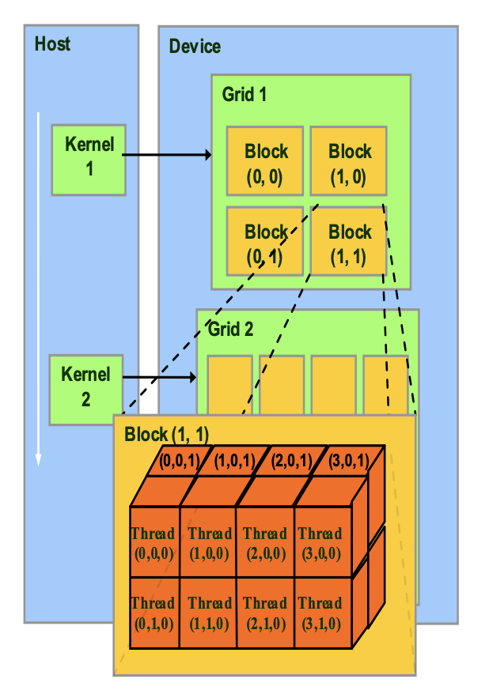
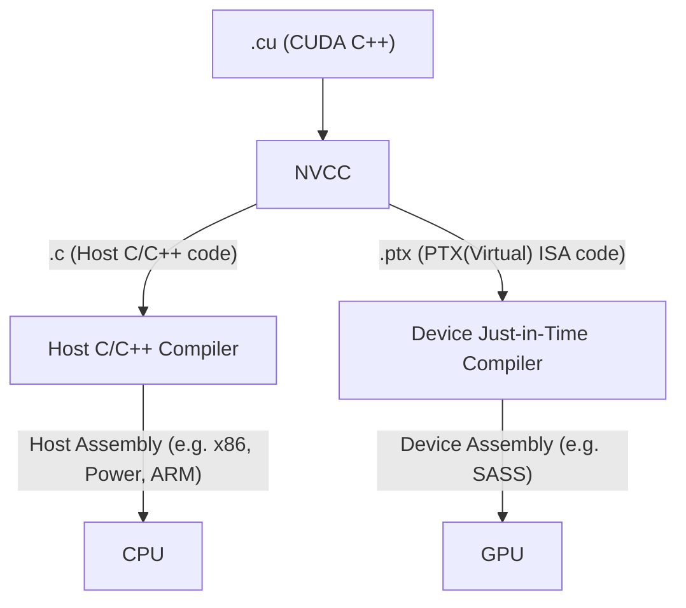
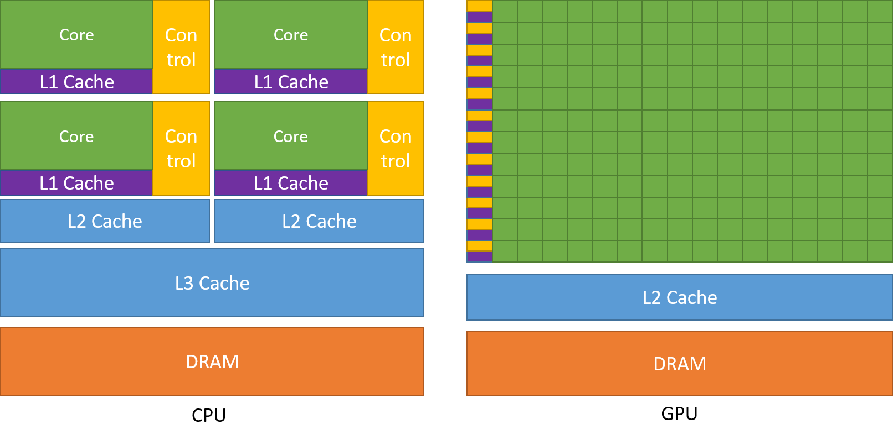

A CUDA kernel is executed as a grid (array) of threads
- All threads in a grid run the same kernel code
- Single Program Multiple Data (SPMD model)
-  Each thread has a unique index that it uses to compute memory addresses and make control decisions

Threads within a block cooperate via shared memory, atomic operations and barrier synchronization

Threads in different blocks cooperate less

Thread block and thread organization simplifies memory addressing when processing multidimensional data

`cudaMalloc()`
- Allocates object in the device global memory
- Two parameters
	- Address of a pointer to the allocated object
	- Size of the allocated object in terms of bytes

`cudaFree()`
- Frees object from device global memory
- Pointer to freed object

cudaMemcpy()
- memory data transfer
- Requires four parameters
	- Pointer to destination
	- Pointer to source
	- Number of bytes copied
	- Type/Direction of transfer

|                                 | Excuted | Callable |
| ------------------------------- | ------- | -------- |
| `__device__` float DeviceFunc() | device  | device   |
| `__global__` void KernelFunc()  | device  | host     |
| `__host__` float HostFunc()     | host    | host     |

1. Reduce, softmax, rms_norm, layer_norm, Transpose
2. bank conflict, roofline 分析, fusion, tiling 策略
3. Flash attention v1 v2 v3
4. naive softmax -> safe softmax -> online softmax -> FA1 FA2 FA3
5. CUDA -> PTX -> SASS

### Cutlass

1. tensorcore, cute, ldswizzle, ldmatrix 等等
2. sgemm, scemv, hgemm, hgemv
3. hopper: TMA, WGMMA, fp8
4. mma, wmma, wgmma

### 内存层级
Host mem -> HBM -> reg, L1 -> HBM -> Host mem

本章内容整理自 [UIUC ECE408/CS483/CSE408 Applied Parallel Programming](https://ece.illinois.edu/academics/courses/ece408)
课后作业：[https://github.com/JerryLinyx/LeNet-CUDA-ECE408](https://github.com/JerryLinyx/LeNet-CUDA-ECE408)
类似课程：[CMU 15-418](https://www.cs.cmu.edu/afs/cs/academic/class/15418-s18/www/index.html), [Stanford CS149](https://gfxcourses.stanford.edu/cs149/fall21)
### Textbook
Wen-mei Hwu, David Kirk and Izzat El Hajj, “Programming Massively Parallel Processors: A Hands-on Approach,” Morgan Kaufman Publisher, 4th edition, 2022, ISBN 978-0-323-91231-0.  The book can be downloaded from [ScienceDirect](https://www.sciencedirect.com/book/9780323912310/programming-massively-parallel-processors).

### NVIDIA documentation
- [NVIDIA Developer Blog (NVIDIA DB)](https://developer.nvidia.com/blog)
- [NVIDIA, CUDA Programming Guide (CUDA PG)](https://docs.nvidia.com/cuda/cuda-programming-guide/)
- [NVIDIA, CUDA C++ Best Practices Guide (CUDA BPG)](https://docs.nvidia.com/cuda/cuda-c-best-practices-guide/index.html)
- [NVIDIA Toolkit CUDA Archived Documentation](http://docs.nvidia.com/cuda/archive/)

## 其他参考

- https://github.com/xlite-dev/LeetCUDA
- https://github.com/karpathy/llm.c
- [有没有一本讲解gpu和CUDA编程的经典入门书籍？ - JerryYin777的回答 - 知乎](https://www.zhihu.com/question/26570985/answer/3465784970)
- [reed - 知乎](https://www.zhihu.com/people/reed-84-49)

CPU vs GPU

| Aspect                     | CPU                                                                                                           | GPU                                                                                        |
| -------------------------- | ------------------------------------------------------------------------------------------------------------- | ------------------------------------------------------------------------------------------ |
| Clock frequency            | High                                                                                                          | Moderate                                                                                   |
| Caches                     | Large - convert long-latency memory accesses into short-latency cache accesses                                | Small - primarily to boost memory throughput                                               |
| Control complexity         | Sophisticated control Branch prediction to reduce branch latency Data forwarding to reduce data latency | Simple control No branch prediction or data forwarding                                  |
| ALU design                 | Powerful ALU — reduced operation latency                                                                      | Energy-efficient ALUs — many units; long latency but heavily pipelined for high throughput |
| Latency tolerance strategy | Rely on caches + speculation + out-of-order/control logic to reduce exposed latency                           | Require a massive number of threads to tolerate (hide) latencies                           |
| Winning                    | For sequential parts where latency hurts                                                                      | For parallel parts where throughput wins                                                   |

