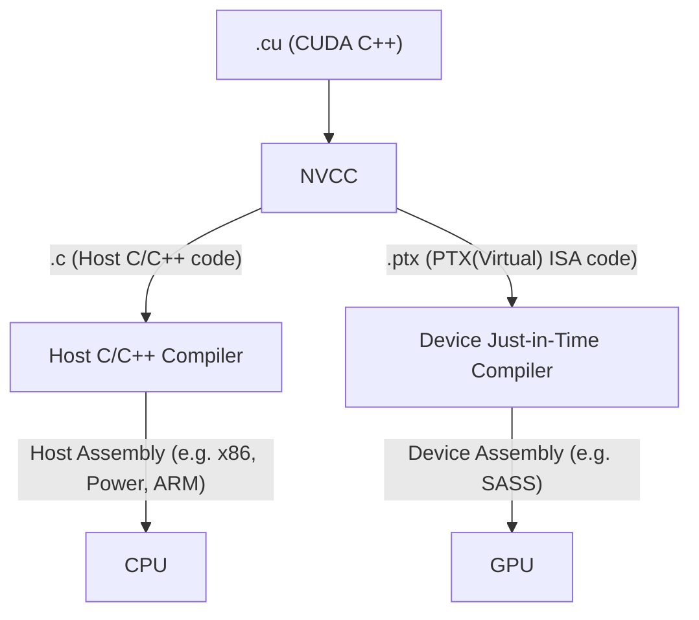
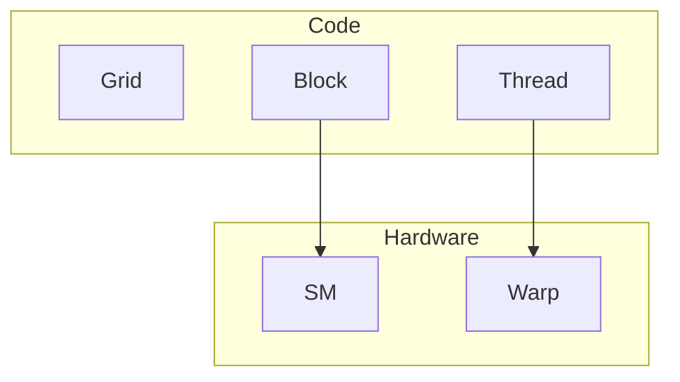

### CPU vs GPU
CPU 关注延迟，而 GPU 关注吞吐

| Aspect                     | CPU                                                                                                           | GPU                                                                                        |
| -------------------------- | ------------------------------------------------------------------------------------------------------------- | ------------------------------------------------------------------------------------------ |
| Clock frequency            | High                                                                                                          | Moderate                                                                                   |
| Caches                     | Large - convert long-latency memory accesses into short-latency cache accesses                                | Small - primarily to boost memory throughput                                               |
| Control complexity         | Sophisticated control<br>Branch prediction to reduce branch latency<br>Data forwarding to reduce data latency | Simple control<br>No branch prediction or data forwarding                                  |
| ALU design                 | Powerful ALU — reduced operation latency                                                                      | Energy-efficient ALUs — many units; long latency but heavily pipelined for high throughput |
| Latency tolerance strategy | Rely on caches + speculation + out-of-order/control logic to reduce exposed latency                           | Require a massive number of threads to tolerate (hide) latencies                           |
| Winning                    | For sequential parts where latency hurts                                                                      | For parallel parts where throughput wins                                                   |


### Process vs Thread

Process 是操作系统分配资源和调度执行的基本单位，
- 拥有独立的虚拟地址空间、页表与内存映射、打开的文件描述符表、信号处理配置、环境变量、进程控制块信息

Thread 是计算的基本单元，Process内可被操作系统独立调度的最小执行单位
- 共享进程资源（地址空间、代码段、堆、全局变量、打开的文件、socket）
- 独立的程序计数器、寄存器上下文、栈、调度状态以及线程局部存储

### CUDA Kernel (Grid, Block, Thread) **Single Program Multiple Data**
A CUDA kernel is executed as a grid (array) of threads
- All threads in a grid run the same kernel code
- Single Program Multiple Data (SPMD model)
- Each thread -> Unique index -> compute memory addresses and make control decisions

Threads within a block cooperate via shared memory, atomic operations and barrier synchronization

Threads in different blocks cooperate less


Thread block and thread organization simplifies memory addressing when processing multidimensional data
### Memory API

`cudaMalloc()`
- Allocates object in the device global memory
- Two parameters
	- Address of a pointer to the allocated object
	- Size of the allocated object in terms of bytes

`cudaFree()`
- Frees object from device global memory
- Pointer to freed object

cudaMemcpy()
- memory data transfer
- Requires four parameters
	- Pointer to destination
	- Pointer to source
	- Number of bytes copied
	- Type/Direction of transfer (`cudaMemcpyHostToDevice`, `cudaMemcpyDeviceToHost`)


### CUDA Function Declarations 函数声明

|                                 | Excuted | Callable |
| ------------------------------- | ------- | -------- |
| `__device__` float DeviceFunc() | device  | device   |
| `__global__` void KernelFunc()  | device  | host     |
| `__host__` float HostFunc()     | host    | host     |
### Compiling A CUDA Program




### CUDA 编程注意事项

 
- Row-Major Layout of 2D Arrays in C/C++
- 边界条件：Handling boundary conditions for pixels near the edges of the image （如卷积核）

### Grid, Block, Thread 续
- Threads in the same block share data and synchronize while doing their share of the work
- Threads in different blocks cannot cooperate
- Blocks execute in arbitrary order

### Block/Threads 与 SM/Warp 关系
Block 分配给 SM (Streaming Multiprocessors，包括shared memory，SP - Streaming Processor)
SM 同时有 block limit 和 thread limit
Threads 同时运行，由 SM 维护 thread/block id，manages/schedules thread execution

e.g. Each block is executed as 32-thread warps
- An implementation decision, not part of the CUDA programming model
- Warps are divided based on their linearized thread index
	- Threads 0-31: warp 0
	- Threads 32-63: warp 1, etc.
- Warps are scheduling units in SM

写代码时看到的是 thread，但硬件调度时看的往往是 warp



SM implements zero-overhead warp scheduling
- 如果某 warp 的下一条指令所需操作数已经 ready，它就 eligible
- scheduler 从 eligible warps 中选一个执行
- 当某个 warp stall 时，SM 可以切换到其他 ready warps。

GPU latency tolerance 的本质，通过足够多的 ready warps 来覆盖延迟 —> occupancy 的意义

### Pitfall: Control/Branch Divergence

Branch divergence：threads in a warp take different paths in the program
(发生条件：must depend on something unique to the thread)

GPUs use predicated execution -> 每条path都计算 -> Multiple paths taken by threads in a warp are executed serially! 分支变串行！

```cpp
if (threadIdx.x > n) {
    // THEN
} else {
    // ELSE
}
```

***ALL THREADS EXECUTE BOTH PATHS***

SOLUTION: 让分支粒度按 warp 大小对齐

```cpp
if (threadIdx.x / WARP_SIZE > 2) {
    // THEN
} else {
    // ELSE
}
```

Still has two control paths, but all threads in any warp follow only one path. 避免 warp 内 divergence.

> [!question]
> Block Granularity Considerations
> For colorToGreyscaleConversion, should one use 8×8, 16×16 or 32×32 blocks? Assume that in the GPU used, each SM can take up to 1,536 threads and up to 8 blocks.
> - For 8×8, we have 64 threads per block. Each SM can take up to 1,536 threads, which is 1,536/64=24 blocks. But each SM can only take up to 8 Blocks, so only 512 threads (16 warps) go into each SM!
> - For 16×16, we have 256 threads per block. Each SM can take up to 1,536 threads (48 warps), which is 6 blocks (within the 8 block limit). Thus, we use the full thread capacity of an SM.
> - For 32×32, we have 1,024 threads per Block. Only one block can fit into an SM, using only 2/3 of the thread capacity of an SM.

结合 SM 的 threads/block 数上限

### Memory

The Von-Neumann Model


Instruction processing: Fetch | Decode | Execute | Memory

Each thread can:
– read/write per-thread registers (~1 cycle)
– read/write per-block shared memory (~5 cycles)
– read/write per-grid global memory (~500 cycles)
– read/only per-grid constant memory (~5 cycles with caching)


| Variable declaration                     | Memory   | Scope  | Lifetime    |
|------------------------------------------|----------|--------|-------------|
| `int LocalVar;`                          | register | thread | thread      |
| `__device__ __shared__ int SharedVar;`   | shared   | block  | block       |
| `__device__ int GlobalVar;`              | global   | app.   | application |
| `__device__ __constant__ int ConstantVar;` | constant | app.   | application |
`__device__`
- optional with `__shared__` or `__constant__`
- not allowed by itself within functions
Automatic variables with no qualifiers
- in **registers** for primitive types and structures
- in **global memory** for per-thread arrays

### MM


二维 grid/block 模版
```cpp
dim3 dimGrid(ceil((1.0*Width)/TILE_WIDTH),
             ceil((1.0*Width)/TILE_WIDTH), 1);
dim3 dimBlock(TILE_WIDTH, TILE_WIDTH, 1);
MatrixMulKernel<<<dimGrid, dimBlock>>>(Md, Nd, Pd, Width);
```

```cpp
__global__ 
void MatrixMulKernel(float* d_M, float* d_N, float* d_P, int Width) 
{
    int Row = blockIdx.y * blockDim.y + threadIdx.y;
    int Col = blockIdx.x * blockDim.x + threadIdx.x;

    if ((Row < Width) && (Col < Width)) {
        float Pvalue = 0;
        for (int k = 0; k < Width; ++k)
            Pvalue += d_M[Row * Width + k] * d_N[k * Width + Col];
        d_P[Row * Width + Col] = Pvalue;
    }
}
```
A simple implementation -> GPU kernel is the CPU code with the outer loops replaced with per-thread index calculations -> bad performance

Why? Global memory bandwidth can’t supply enough data to keep the SMs busy. 
accesses to global memory:
`d_M[Row * Width + k]`, `d_N[k * Width + Col]`, `d_P[Row * Width + Col]`


1. Reduce, softmax, rms_norm, layer_norm, Transpose
2. bank conflict, roofline 分析, fusion, tiling 策略
3. Flash attention v1 v2 v3
4. naive softmax -> safe softmax -> online softmax -> FA1 FA2 FA3
5. CUDA -> PTX -> SASS

### Cutlass

1. tensorcore, cute, ldswizzle, ldmatrix 等等
2. sgemm, scemv, hgemm, hgemv
3. hopper: TMA, WGMMA, fp8
4. mma, wmma, wgmma

### 内存层级
Host mem -> HBM -> reg, L1 -> HBM -> Host mem

本章内容整理自 [UIUC ECE408/CS483/CSE408 Applied Parallel Programming](https://ece.illinois.edu/academics/courses/ece408)
课后作业：[https://github.com/JerryLinyx/LeNet-CUDA-ECE408](https://github.com/JerryLinyx/LeNet-CUDA-ECE408)
类似课程：[CMU 15-418](https://www.cs.cmu.edu/afs/cs/academic/class/15418-s18/www/index.html), [Stanford CS149](https://gfxcourses.stanford.edu/cs149/fall21)
### Textbook
Wen-mei Hwu, David Kirk and Izzat El Hajj, “Programming Massively Parallel Processors: A Hands-on Approach,” Morgan Kaufman Publisher, 4th edition, 2022, ISBN 978-0-323-91231-0.  The book can be downloaded from [ScienceDirect](https://www.sciencedirect.com/book/9780323912310/programming-massively-parallel-processors).

### NVIDIA documentation
- [NVIDIA Developer Blog (NVIDIA DB)](https://developer.nvidia.com/blog)
- [NVIDIA, CUDA Programming Guide (CUDA PG)](https://docs.nvidia.com/cuda/cuda-programming-guide/)
- [NVIDIA, CUDA C++ Best Practices Guide (CUDA BPG)](https://docs.nvidia.com/cuda/cuda-c-best-practices-guide/index.html)
- [NVIDIA Toolkit CUDA Archived Documentation](http://docs.nvidia.com/cuda/archive/)

## 其他参考
- https://github.com/gpu-mode/lectures
- https://github.com/xlite-dev/LeetCUDA
- https://github.com/karpathy/llm.c
- [有没有一本讲解gpu和CUDA编程的经典入门书籍？ - JerryYin777的回答 - 知乎](https://www.zhihu.com/question/26570985/answer/3465784970)
- [reed - 知乎](https://www.zhihu.com/people/reed-84-49)


