## Fundamentals
### CPU vs GPU
CPU 关注延迟，而 GPU 关注吞吐

| Aspect                     | CPU                                                                                                           | GPU                                                                                        |
| -------------------------- | ------------------------------------------------------------------------------------------------------------- | ------------------------------------------------------------------------------------------ |
| Clock frequency            | High                                                                                                          | Moderate                                                                                   |
| Caches                     | Large - convert long-latency memory accesses into short-latency cache accesses                                | Small - primarily to boost memory throughput                                               |
| Control complexity         | Sophisticated control<br>Branch prediction to reduce branch latency<br>Data forwarding to reduce data latency | Simple control<br>No branch prediction or data forwarding                                  |
| ALU design                 | Powerful ALU — reduced operation latency                                                                      | Energy-efficient ALUs — many units; long latency but heavily pipelined for high throughput |
| Latency tolerance strategy | Rely on caches + speculation + out-of-order/control logic to reduce exposed latency                           | Require a massive number of threads to tolerate (hide) latencies                           |
| Winning                    | For sequential parts where latency hurts                                                                      | For parallel parts where throughput wins                                                   |


### Process vs Thread

Process 是操作系统分配资源和调度执行的基本单位，
- 拥有独立的虚拟地址空间、页表与内存映射、打开的文件描述符表、信号处理配置、环境变量、进程控制块信息

Thread 是计算的基本单元，Process内可被操作系统独立调度的最小执行单位
- 共享进程资源（地址空间、代码段、堆、全局变量、打开的文件、socket）
- 独立的程序计数器、寄存器上下文、栈、调度状态以及线程局部存储

### CUDA Kernel - Grid, Block, Thread (**Single Program Multiple Data**)
A CUDA kernel is executed as a grid (array) of threads
- All threads in a grid run the same kernel code
- Single Program Multiple Data (SPMD model)
- Each thread -> Unique index -> compute memory addresses and make control decisions

Threads within a block cooperate via shared memory, atomic operations and barrier synchronization

Threads in different blocks cooperate less


Thread block and thread organization simplifies memory addressing when processing multidimensional data
### Memory API
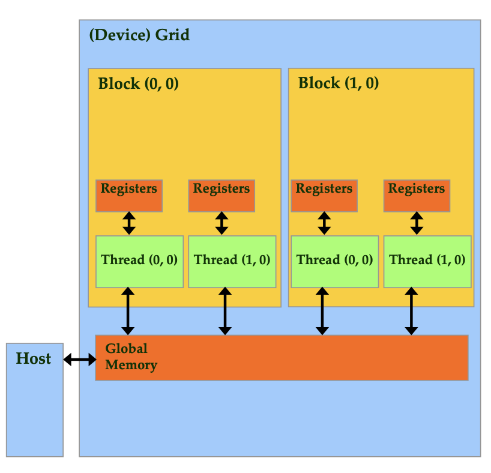
`cudaMalloc()`
- Allocates object in the device global memory
- Two parameters
	- Address of a pointer to the allocated object
	- Size of the allocated object in terms of bytes

`cudaFree()`
- Frees object from device global memory
- Pointer to freed object

cudaMemcpy()
- memory data transfer
- Requires four parameters
	- Pointer to destination
	- Pointer to source
	- Number of bytes copied
	- Type/Direction of transfer (`cudaMemcpyHostToDevice`, `cudaMemcpyDeviceToHost`)


### CUDA Function Declarations 函数声明

|                                 | Excuted | Callable |
| ------------------------------- | ------- | -------- |
| `__device__` float DeviceFunc() | device  | device   |
| `__global__` void KernelFunc()  | device  | host     |
| `__host__` float HostFunc()     | host    | host     |
### Compiling A CUDA Program

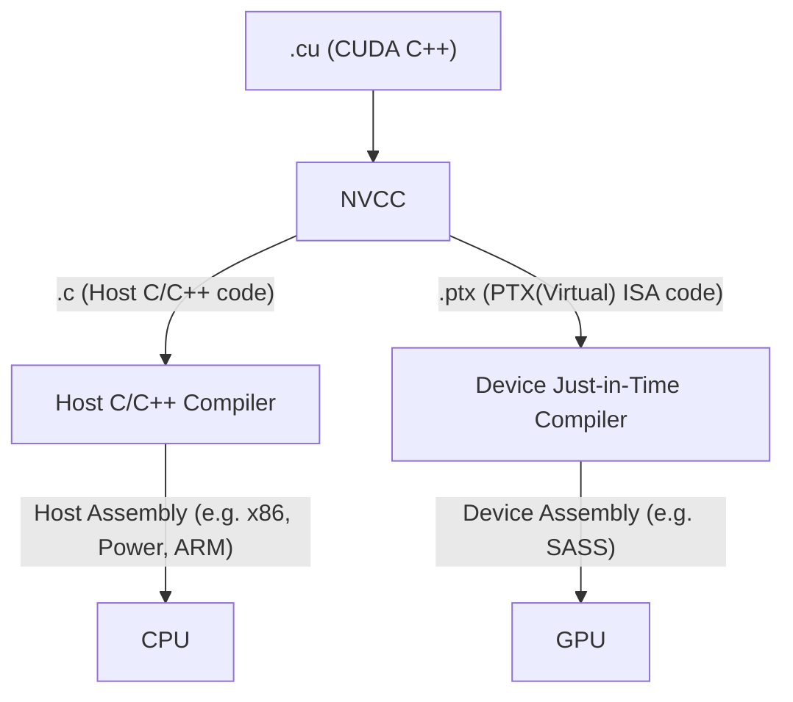


### CUDA 编程注意事项

 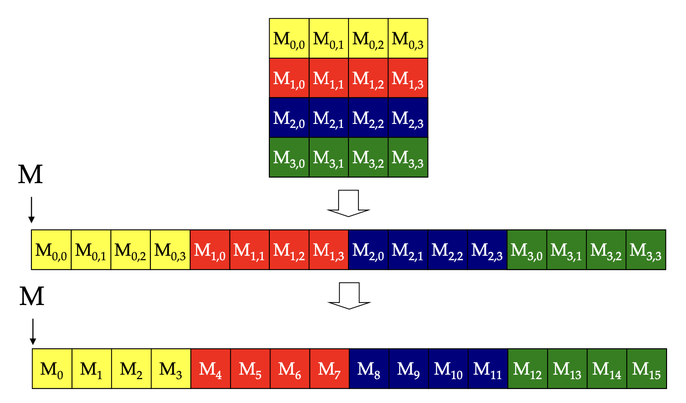
- Row-Major Layout of 2D Arrays in C/C++
- 边界条件：Handling boundary conditions for pixels near the edges of the image （如卷积核）

### Grid, Block, Thread 续
- Threads in the same block share data and synchronize while doing their share of the work
- Threads in different blocks cannot cooperate
- Blocks execute in arbitrary order

### Block/Threads 与 SM/Warp 关系
Block 分配给 SM (Streaming Multiprocessors，包括shared memory，SP - Streaming Processor)
SM 同时有 block limit 和 thread limit
Threads 同时运行，由 SM 维护 thread/block id，manages/schedules thread execution

e.g. Each block is executed as 32-thread warps
- An implementation decision, not part of the CUDA programming model
- Warps are divided based on their linearized thread index
	- Threads 0-31: warp 0
	- Threads 32-63: warp 1, etc.
- Warps are scheduling units in SM

写代码时看到的是 thread，但硬件调度时看的往往是 warp


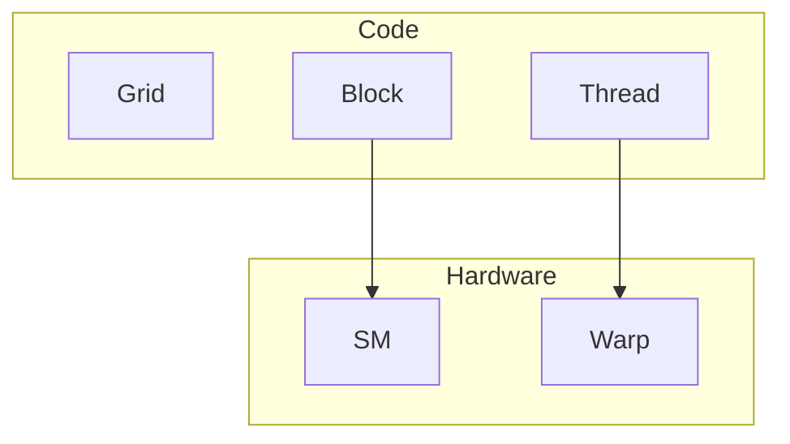
SM implements zero-overhead warp scheduling
- 如果某 warp 的下一条指令所需操作数已经 ready，它就 eligible
- scheduler 从 eligible warps 中选一个执行
- 当某个 warp stall 时，SM 可以切换到其他 ready warps。

GPU latency tolerance 的本质，通过足够多的 ready warps 来覆盖延迟 —> occupancy 的意义

### Pitfall: Control/Branch Divergence

Branch divergence：threads in a warp take different paths in the program
(发生条件：must depend on something unique to the thread)

GPUs use predicated execution -> 每条path都计算 -> Multiple paths taken by threads in a warp are executed serially! 分支变串行！

```cpp
if (threadIdx.x > n) {
    // THEN
} else {
    // ELSE
}
```

***ALL THREADS EXECUTE BOTH PATHS***

SOLUTION: 让分支粒度按 warp 大小对齐

```cpp
if (threadIdx.x / WARP_SIZE > 2) {
    // THEN
} else {
    // ELSE
}
```

Still has two control paths, but all threads in any warp follow only one path. 避免 warp 内 divergence.

> [!question]
> Block Granularity Considerations
> For colorToGreyscaleConversion, should one use 8×8, 16×16 or 32×32 blocks? Assume that in the GPU used, each SM can take up to 1,536 threads and up to 8 blocks.
> - For 8×8, we have 64 threads per block. Each SM can take up to 1,536 threads, which is 1,536/64=24 blocks. But each SM can only take up to 8 Blocks, so only 512 threads (16 warps) go into each SM!
> - For 16×16, we have 256 threads per block. Each SM can take up to 1,536 threads (48 warps), which is 6 blocks (within the 8 block limit). Thus, we use the full thread capacity of an SM.
> - For 32×32, we have 1,024 threads per Block. Only one block can fit into an SM, using only 2/3 of the thread capacity of an SM.

结合 SM 的 threads/block 数上限

### Memory

The Von-Neumann Model
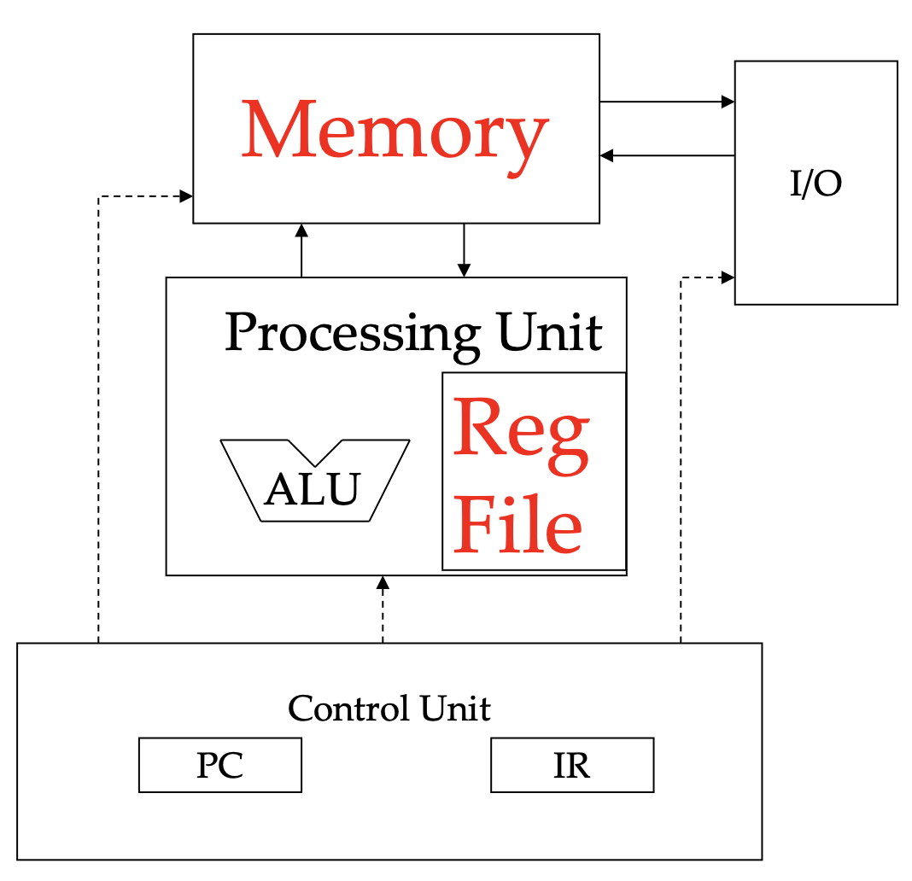

Instruction processing: Fetch | Decode | Execute | Memory

Each thread can:
– read/write per-thread registers (~1 cycle)
– read/write per-block shared memory (~5 cycles)
– read/write per-grid global memory (~500 cycles)
– read/only per-grid constant memory (~5 cycles with caching)

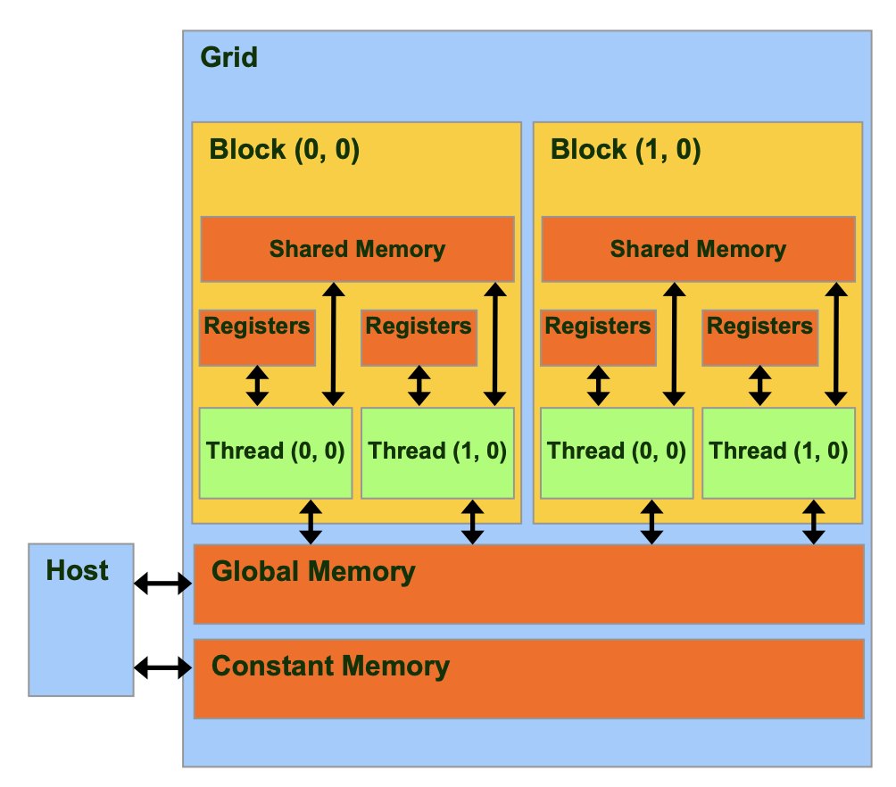


| Variable declaration                     | Memory   | Scope  | Lifetime    |
|------------------------------------------|----------|--------|-------------|
| `int LocalVar;`                          | register | thread | thread      |
| `__device__ __shared__ int SharedVar;`   | shared   | block  | block       |
| `__device__ int GlobalVar;`              | global   | app.   | application |
| `__device__ __constant__ int ConstantVar;` | constant | app.   | application |
`__device__`
- optional with `__shared__` or `__constant__`
- not allowed by itself within functions
Automatic variables with no qualifiers
- in **registers** for primitive types and structures
- in **global memory** for per-thread arrays

### MM - Matrix Multiplication


二维 grid/block tile baseline
```cpp
dim3 dimGrid(ceil((1.0*Width)/TILE_WIDTH),
             ceil((1.0*Width)/TILE_WIDTH), 1);
dim3 dimBlock(TILE_WIDTH, TILE_WIDTH, 1);
MatrixMulKernel<<<dimGrid, dimBlock>>>(Md, Nd, Pd, Width);
```

```cpp
__global__ 
void MatrixMulKernel(float* d_M, float* d_N, float* d_P, int Width) 
{
    int Row = blockIdx.y * blockDim.y + threadIdx.y;
    int Col = blockIdx.x * blockDim.x + threadIdx.x;

    if ((Row < Width) && (Col < Width)) {
        float Pvalue = 0;
        for (int k = 0; k < Width; ++k)
            Pvalue += d_M[Row * Width + k] * d_N[k * Width + Col];
        d_P[Row * Width + Col] = Pvalue;
    }
}
```
A simple implementation -> GPU kernel is the CPU code with the outer loops replaced with per-thread index calculations -> bad performance

Why? 

**Global memory bandwidth** can’t supply enough data to keep the SMs busy. 

Accesses to global memory: `d_M[Row * Width + k]`, `d_N[k * Width + Col]`, `d_P[Row * Width + Col]`

Each Thread Requires 4B of Data per FLOP. How to Compute?
- Every threads access global memory -> for elements of M and N, 4B each, or 8B per pair. (And once TOTAL to P per thread—ignore it.)
- With each pair of elements, a thread does a single multiply-add -> 2 FLOP (floating-point operations)
- So for every FLOP, a thread needs 4B from memory -> **4B / FLOP**.

For N GB/s of memory bandwidth, $\frac{N \, GB/s}{4B / FLOP} = \frac{N}{4} \,GFLOP/s$
这正是 roofline thinking 的雏形：上限不是只看峰值 FLOPS，还要看带宽和计算强度。
$\frac{N}{4} \,GFLOP/s$ 只是理想带宽上限，实际运行更少，memory is not busy all the time, 以及访存调度不完美、pipeline stall ...

What to Do? Reuse Memory Accesses! -> drastically cut down accesses to Global Memory

### Global Memory -> Shared Memory
Global memory is implemented with DRAM -> slow -> tile the input data to take advantage of **Shared Memory**

- Read tile(s) into shared memory using multiple threads to exploit memory-level parallelism.
- Compute based on shared memory tiles.
- Repeat.
- Write results back to global memory.

```cpp
__shared__ float subTileM[TILE_WIDTH][TILE_WIDTH];
__shared__ float subTileN[TILE_WIDTH][TILE_WIDTH];
```

### Tiled Multiply

tiling 为什么会大幅提高理论性能上限?

Observe that each input element of M and N is used WIDTH times.
如果 tile 是 W×W，那么每个加载进来的 operand 会被用于 W 次运算，于是 global memory accesses 减少 W 倍 -> bandwidth limit 提高 W 倍。

tiling 提高的是 arithmetic intensity


For each tile,
- Phase 1: Load tiles of M & N into share memory
	- 每个线程加载一个 M 元素和一个 N 元素 -> 加载工作被线程并行分担
	- 并且要让一个 warp 内的访问尽量 coalesced
- Phase 2: Calculate partial dot product for tile of P

```cpp
// Step1 (2D indexing) -> (But 1D indexing only)
M[Row][q*TILE_WIDTH+tx] 
-> M[Row*Width + q*TILE_WIDTH + tx] 
N[q*TILE_WIDTH+ty][Col] 
-> N[(q*TILE_WIDTH+ty) * Width + Col]

// Step2
subTileM[ty][k] * subTileN[k][tx]
```

tile 大小不只看 reuse，也要看 block 线程数、shared memory 占用、active blocks/threads per SM 等资源约束
### Barrier Synchronization `__syncthreads()`

线程怎么知道别的线程已经把 tile 加载完 -> Synchronize!

How does Bulk Synchronous work? Use a **barrier**

`__syncthreads()`

All threads **in the same block** must reach the `__syncthreads()`
before any can move on

### Device Query

Number of devices in the system
```cpp
int dev_count;
cudaGetDeviceCount(&dev_count);
```

 Capability of devices
```cpp
cudaDeviceProp dev_prop;
for (i = 0; i < dev_count; i++) {
	cudaGetDeviceProperties(&dev_prop, i);
// decide if device has sufficient resources and capabilities
}
```

cudaDeviceProp is a built-in C structure type
- dev_prop.maxThreadsPerBlock
- dev_prop.sharedMemoryPerBlock
- …


### tile 边界处理

边界非整数倍 Width

- Threads that calculate valid P elements but can step outside valid input
- Threads that do not calculate valid P elements

Write 0 for Missing Elements
(If yes, proceed to load; Otherwise, just write 0 to shared memory)
-> Benefit: No specialization during tile use

For Threads outside of P calculate 0, but store nothing. 防止 out of index

```cpp
for (int m = 0; m < (Width - 1)/TILE_WIDTH + 1; ++m)
```


```cpp
// Tile loading
if (Row < Width && m*TILE_WIDTH+tx < Width) {
	// as before
	subTileM[ty][tx] = M[Row*Width + m*TILE_WIDTH+tx];
} else {
	subTileM[ty][tx] = 0;
}

if (m*TILE_WIDTH+ty < Width && Col < Width ) {
	// as before
	subTileN[ty][tx] = N[(m*TILE_WIDTH+ty)*Width+Col];
} else {
	subTileN[ty][tx] = 0;
}

// save a little energy (fewer floating-point ops)
if (Row < Width && Col < Width) { 
	// as before
	for (int k = 0; k < TILE_WIDTH; ++k)
		Pvalue += subTileM[ty][k] * subTileN[k][tx];
}

// write back
if (Row < Width && Col < Width) {
	// as before
	P[Row*Width+Col] = Pvalue;
}
```


> [!note]
> - Conditions are different for M and N elements
> - Branch divergence affects only blocks on boundaries, and should be small for large matrices.
> - What about rectangular matrices?


DRAM (multi banks, Burst & Coalesce)

Random Access Memory (RAM):
same time needed to read/write any address

Dynamic RAM (DRAM):
- bit stored on a capacitor
- connected via transistor to bit line for read/write
- bits disappear after a while (around 50 msec, due to tiny leakage currents through transistor), and must be rewritten (hence dynamic)

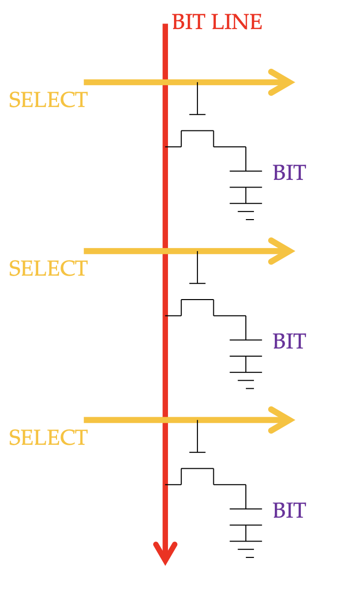

- About 1,000 cells connect to each BIT LINE. 
- Connection/disconnection depends on SELECT line.
- Some address bits decoded to connect exactly one cell to the BIT LINE.

Capacitance is tiny for the BIT, but huge for the BIT LINE -> Use an amplifier for higher speed! -> still slow, but only need only need 1 transistor per bit -> DRAM is Slow, Dense & Cheap

SELECT lines connect to about 1,000 bit lines.
Core array has about O(1M) bits
Use more address bits to choose bit line(s).

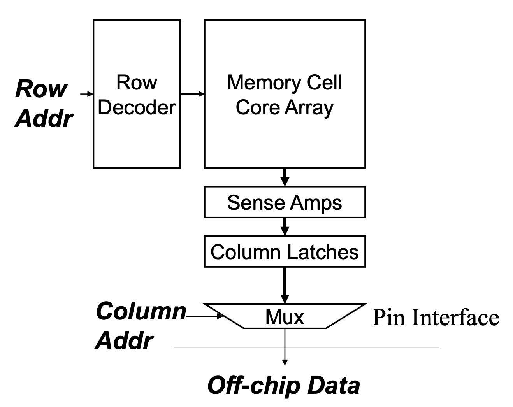


DRAM cells are not clocked (clocking requires transistors).
**DRAM interfaces are clocked.**
- DDR: Core speed = ½ interface speed
- DDR2/GDDR3: Core speed = ¼ interface speed
- DDR3/GDDR4: Core speed = ⅛ interface speed
- … likely to be worse in the future

现代 DRAM 几乎总是按 burst mode 工作
core array access delay 很大, 连续送多个相邻数据更划算

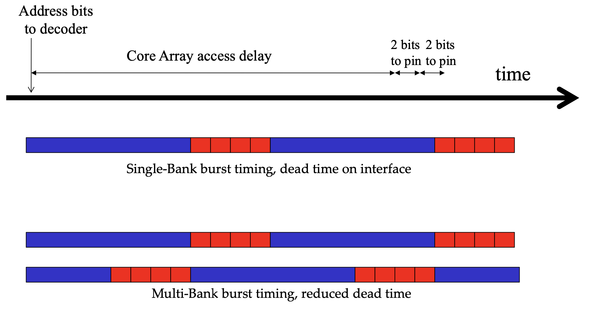
multiple banks 把不同 bank 的访问交错起来 -> 提升吞吐


For naive matmul, N accesses are coalesced, M accesses are not coalesced. 

Tiled matmul use shared memory to enable coalescing.


### Convolution

$$
f(x) * g(x) = \int_{-\infty}^{\infty} f(\tau)\cdot g(x-\tau)\, d\tau
$$

$$
f[x] * g[x] = \sum_{k=-\infty}^{\infty} f[k]\cdot g[x-k]
$$

ghost cells (apron cells, halo cells）- 支持边界附近的局部邻域计算而引入的外围数据区，常设为0

mask (convolution kernel / filter) - a good candidate for Constant Memory


### Cache & Locality
A cache is an “array” of cache lines 
cache line: data from several consecutive memory addresses
Additional hardware is used to remember the addresses of the data in
the cache line

memory bursts contain around 1024 bits (128B) from consecutive addresses

Memory Accesses Show Locality
- **Spatial locality**: when the data elements stored in consecutive memory locations are accessed consecutively
- **Temporal locality**: when the same data element is accessed multiple times in short period of time

Caches are smaller than memory
When cache is full, must make room for new line, usually by discarding least recently used line.


### Shared Memory vs. Cache
同
- In terms of distance from the SMs, shared memory is similar to L1 cache
- Both on chip (SRAM), with similar performance
异
- Programmer controls shared memory contents (scratchpad). 程序员显式管理 
- Microarchitecture automatically determines contents of cache. 硬件自动管理
### Constant Cache vs. L1 Cache

普通 L1 cache 要支持写回，因为 global memory 里的数据可能被修改，所以需要额外逻辑追踪 dirty status

constant cache 面向的是 kernel 执行期间不会被修改的只读数据，因此硬件可以做更激进、更轻量的优化，使得吞吐比一般 L1 更高

### Constant Memory
Allocate device memory for M (the mask)
- outside of all functions
- `__constant__`
- For copying to device memory, use `cudaMemcpyToSymbol(dest, src, size, offset = 0, kind =cudaMemcpyHostToDevice)`

### GPU L2/L1 Caches

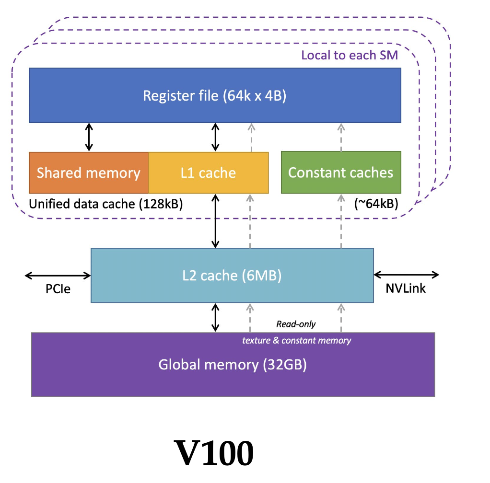

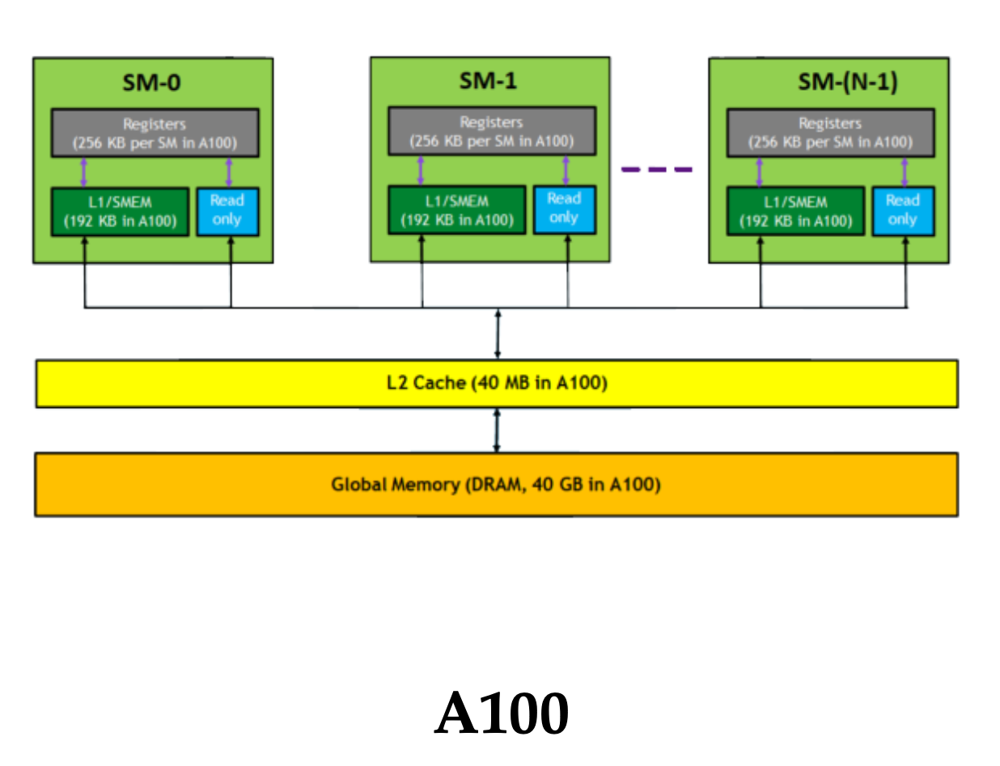

### Tiled Convolution

reuse data read from global memory -> shared memory

Halo Access
from Global Memory?
- Optimize reuse of shared memory (halo reuse is smaller)
- Branch divergence; Halo **too narrow to fill** a memory burst
to Shared Memory?
- Coalesce global memory accesses; No branch divergence during computation
- Some threads must do >1 load, so some branch divergence in reading; Slightly more shared memory needed

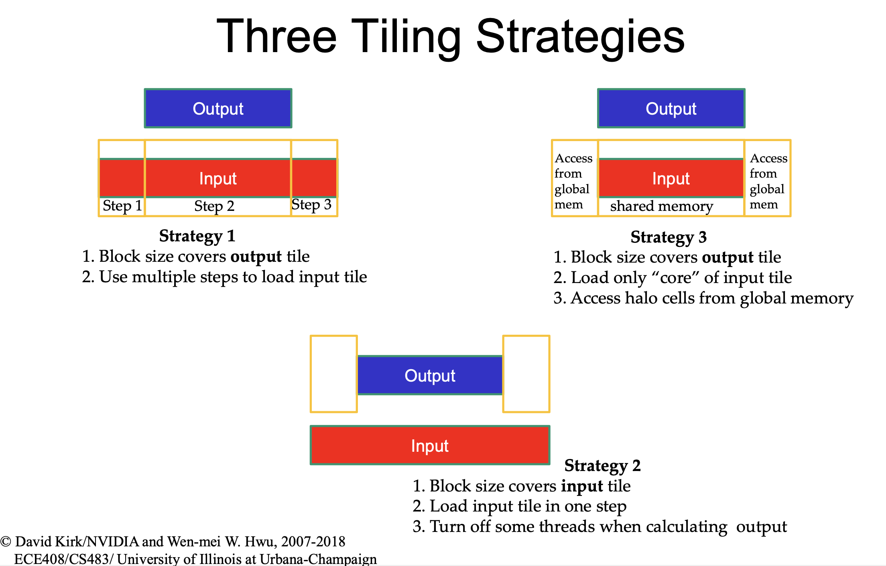


## CUDA Programming
1. Reduce, softmax, rms_norm, layer_norm, Transpose
2. bank conflict, roofline 分析, fusion, tiling 策略
3. Flash attention v1 v2 v3
4. naive softmax -> safe softmax -> online softmax -> FA1 FA2 FA3
5. CUDA -> PTX -> SASS

### Cutlass Programming

1. tensorcore, cute, ldswizzle, ldmatrix 等等
2. sgemm, scemv, hgemm, hgemv
3. hopper: TMA, WGMMA, fp8
4. mma, wmma, wgmma
## Cute

## Triton
### 内存层级
Host mem -> HBM -> reg, L1 -> HBM -> Host mem

## Reference
本章内容整理自 [UIUC ECE408/CS483/CSE408 Applied Parallel Programming](https://ece.illinois.edu/academics/courses/ece408)
课后作业：[https://github.com/JerryLinyx/LeNet-CUDA-ECE408](https://github.com/JerryLinyx/LeNet-CUDA-ECE408)
类似课程：[CMU 15-418](https://www.cs.cmu.edu/afs/cs/academic/class/15418-s18/www/index.html), [Stanford CS149](https://gfxcourses.stanford.edu/cs149/fall21)
### Textbook
Wen-mei Hwu, David Kirk and Izzat El Hajj, “Programming Massively Parallel Processors: A Hands-on Approach,” Morgan Kaufman Publisher, 4th edition, 2022, ISBN 978-0-323-91231-0.  The book can be downloaded from [ScienceDirect](https://www.sciencedirect.com/book/9780323912310/programming-massively-parallel-processors).

### NVIDIA documentation
- [NVIDIA Developer Blog (NVIDIA DB)](https://developer.nvidia.com/blog)
- [NVIDIA, CUDA Programming Guide (CUDA PG)](https://docs.nvidia.com/cuda/cuda-programming-guide/)
- [NVIDIA, CUDA C++ Best Practices Guide (CUDA BPG)](https://docs.nvidia.com/cuda/cuda-c-best-practices-guide/index.html)
- [NVIDIA Toolkit CUDA Archived Documentation](http://docs.nvidia.com/cuda/archive/)

### Other resources
- https://github.com/gpu-mode/lectures
- https://github.com/xlite-dev/LeetCUDA
- https://github.com/karpathy/llm.c
- [有没有一本讲解gpu和CUDA编程的经典入门书籍？ - JerryYin777的回答 - 知乎](https://www.zhihu.com/question/26570985/answer/3465784970)
- [reed - 知乎](https://www.zhihu.com/people/reed-84-49)


