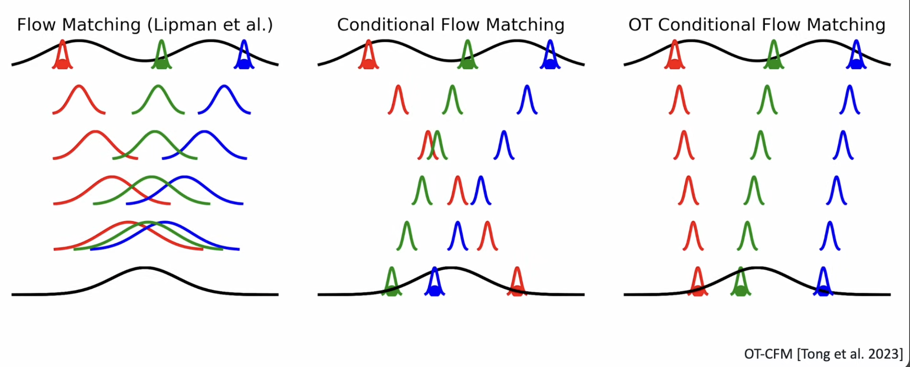

# [[../../科研/flow/NF/TARFlow]]
## Transformer
NF仿射耦合层可以推广到多块划分
$$\begin{aligned}&\boldsymbol{h}_1 = \boldsymbol{x}_1\\ &\boldsymbol{h}_k = \exp(\boldsymbol{\gamma}_k(\boldsymbol{x}_{< k}))\otimes\boldsymbol{x}_k + \boldsymbol{\beta}_k(\boldsymbol{x}_{< k})\end{aligned}$$
其中$k>1$，$x_{<k}=[x_1,x_2,⋯,x_{k−1}]$
Transformer的输入本质上是一个无序的向量集合，换言之不依赖局部相关性，因此以Transformer为主架构，我们就可以选择在空间维度划分，这就是Patchify。
此外，观式$h_k=⋯(x_{<k})$形式，意味着这是一个Causal模型，这也正好可以用Transformer高效实现。

## Score-based Denoising
如果$q_{\boldsymbol{\theta}}(\boldsymbol{x})$是加噪$\mathcal{N}(\boldsymbol{0},\sigma^2 \boldsymbol{I})$训练后的概率密度函数，那么  $\boldsymbol{r}(\boldsymbol{x}) = \boldsymbol{x} + \sigma^2 \nabla_{\boldsymbol{x}} \log q_{\boldsymbol{\theta}}(\boldsymbol{x})$ 就是去噪模型的理论最优解。
$$\boldsymbol{z}\sim \mathcal{N}(\boldsymbol{0},\boldsymbol{I}) ,\quad \boldsymbol{y} =\boldsymbol{g}_{\boldsymbol{\theta}}(\boldsymbol{z}),\quad\boldsymbol{x} = \boldsymbol{y} + \sigma^2 \nabla_{\boldsymbol{y}} \log q_{\boldsymbol{\theta}}(\boldsymbol{y})$$

# [[../../科研/flow/NF/STARFlow]]

## Deep-Shallow Architecture
TARFlow 采用均匀的计算分配策略，即所有的流块（Flow Blocks）都拥有相同大小和层数的 Transformer（例如 8 个块，每块 8 层）。
STARFlow 引入非对称的 Deep-Shallow 设计 。
- Deep Block (深层块)：仅第一个块（最接近先验噪声的块）非常深（例如 18-24 层），占据绝大多数参数 。
- Shallow Blocks (浅层块)：随后的块非常浅（例如仅 2 层），用于细化图像细节 。
优化逻辑：研究发现，归一化流的计算主要集中在靠近先验分布的一端（Deep Block），而后续步骤主要负责局部微调。这种非对称设计大幅提高了参数效率和推理时的可扩展性 。

## VAE 
TARFlow 直接对原始像素进行建模。这在高分辨率下计算量极大，且难以捕捉高层语义。STARFlow 在预训练自编码器（如 Stable Diffusion 的 VAE）的 **Latent Space** 中学习流模型。
**优化逻辑**：归一化流天然更适合处理压缩后的潜变量分布，而非直接处理高维像素。这一改变直接使模型能够扩展到 $512 \times 512$ 甚至 $1024 \times 1024$ 的高分辨率 。

## ?引导算法优化 Principled CFG
TARFlow 使用朴素的线性外推公式 $\tilde{\mu}_{c}=\mu_{c}+\omega(\mu_{c}-\mu_{u})$ 来实现分类器无关引导（CFG）。这种方法在高引导权重（High Guidance Weight）下极不稳定，导致图像崩坏。
STARFlow重新推导了基于高斯分布分数的 CFG 公式。新公式不仅调整均值，还根据方差比 $s = \sigma_c^2 / \sigma_u^2$ 动态缩放方差：$\tilde{\sigma}_{c}=\frac{1}{\sqrt{1+\omega-\omega s}}\cdot\sigma_{c}$ 
**优化逻辑**：新算法在较大的引导权重下（文本生成通常需要 $\omega > 4$）依然保持稳定，显著提升了文本到图像（Text-to-Image）的生成质量。

## 去噪策略优化 Decoder Finetuning
TARFlow 由于流模型训练必须注入噪声（防止流形塌缩），TARFlow 在采样后需要使用额外的 Score-based denoising 来去除噪声 。
STARFlow 直接对 VAE 的解码器（Pixel Decoder）进行微调 。训练解码器时，直接输入带有噪声的潜变量，让解码器学会“去噪+解码”一步到位 。
优化逻辑：这种方法比单独运行去噪网络更简单且效果更好。

**推理速度慢**：现有的高性能 NF（如 TARFlow）依赖自回归流（Autoregressive Flows）。这意味着在生成（逆向）过程中，必须按顺序逐个 token 生成，推理步骤数与序列长度成正比（例如 $8 \times 256$ 步），导致极高的延迟。    
**架构受限**：为了保证雅可比行列式（Jacobian determinant）易于计算，模型被迫使用因果掩码（Causal Masking），这使得逆向模型无法利用非因果的双向注意力机制（Non-causal Attention），限制了表达能力。
# [[../../科研/flow/NF/BiFlow]]

放弃“逆向过程必须是正向过程的数学精确逆”
用一个标准的 NF 作为“教师”来生成从数据到噪声的轨迹，然后训练一个完全独立的、架构灵活的“学生”模型来近似这个逆过程。

在 ImageNet 256x256 上，BiFlow-B/2 达到 **2.39 FID**，显著优于其正向模型 iTARFlow (6.83 FID) 和其他 1-NFE 方法（如 Rectified Flow 的 2.58）。
MeanFlow？

Wall-clock Time：
TPU 上：比 iTARFlow 快 224倍 。
GPU 上：比 iTARFlow 快 60倍 。
生成一张图仅需 2.15ms (GPU) 或 0.29ms (TPU) 。

# [[../../科研/flow/FM/ReFlow]]

ReFlow 构造一条 **时间连续的轨迹**：$x(t) = (1 - t)\,x_1 + t\,x_0, \quad t \in [0,1]$

并训练一个 **速度场（vector field）**：$$v_\theta(x,t) \approx \frac{d x(t)}{dt} = x_0 - x_1$$
$$\mathcal{L}(\theta) = \mathbb{E}_{x_0, x_1, t} \Big[ \big\| v_\theta(x(t), t) - (x_0 - x_1) \big\|^2 \Big]$$
sample-level 近似

# [[../../科研/flow/FM/MeanFlow]]

引入并建模平均速度（average velocity）
> 如果一个点的“正确流向”不唯一，那为什么不学它的期望方向？

$$ v^{*}(x,t) =  \mathbb{E}[x_0 - x_1 \mid x(t)=x] $$
$$\mathcal{L} = \mathbb{E}_{x,t} \left[ \|v_\theta(x,t) - \mathbb{E}[x_0-x_1 \mid x(t)=x]\|^2 \right]$$

### 和ShortCut相比有什么优点？
ShortCut曾经也是单步生成的SOTA选手。ShortCut的核心思想是课程学习——先教网络做多步生成，然后逐渐减少步数，最后蒸馏成单步。但它的问题是需要预训练，你得先有个多步模型。而且它的蒸馏过程也很复杂，步数逐渐减少的schedule怎么设计？每个阶段训练多久？超参数一堆。而且它的上限受限于teacher，你的单步模型再强，也不会比那个多步teacher强太多

>MeanFlow原来的问题MeanFlow的训练目标是直接最小化平均速度的loss。听起来很直接对吧？但问题在于这个目标平均速度𝑢∗的计算里，包含了网络自身输出的导数项。简单来说就如果你要算loss，得先知道网络输出；但网络输出本身又依赖于这个loss的梯度。这就形成了一个"自引用"的循环依赖。虽然数学上可以推导，但优化过程会变得不稳定。训练曲线抖得像心电图，有时候甚至直接崩溃。

# [[../../科研/flow/FM/IMF]]
优化了MeanFlow的Loss

iMF的做法是网络还是输出平均速度u，但loss用瞬时速度v来算。 
**MeanFlow Identity 的逆向思维**：MeanFlow 恒等式 $u = v - (t-r)\frac{du}{dt}$ 建立了平均速度 $u$ 和瞬时速度 $v$ 的关系。原始 MF 试图拟合 $u$，但作者发现可以将其重写为 $$v = u + (t-r)\frac{du}{dt}$$iMF利用这个关系把训练问题重新formulate成了一个标准的回归问题。

**CFG处理**
常规的CFG是在推理时做的，得跑两次网络——一次有条件，一次无条件——然后按比例混合。这对多步生成没什么问题，可对单步生成来说，效率直接砍半。
iMF的做法是把guidance scale w作为显式的条件变量塞进训练里。