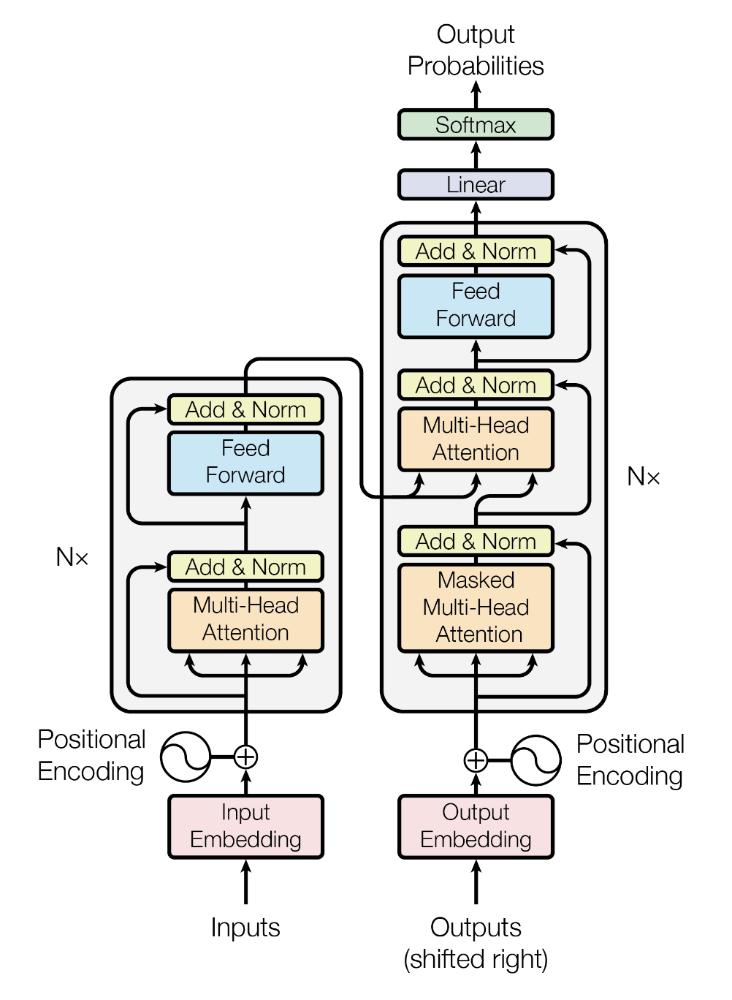

## 基础

> 经典贝叶斯公式：$$P(Y \mid X) = \frac{P(X \mid Y)\,P(Y)}{P(X)}$$- $Y$：假设 / 隐变量（hypothesis）
> - $X$：观测数据
> - $P(Y)$：先验（prior）
> - $P(X \mid Y)$：似然（likelihood）
> - $P(Y \mid X)$：后验（posterior）

## CNN
- MLP的问题：全连接数据量过大
- 数据特性：图像局部性 locality 
- 平移不变性 

## RNN
时序问题

$$h_t = \phi(w_2h_{t-1} + w_1x_t + b)$$
$\phi$ 的选择：
- 非0： Relu
- 0 - 1： sigmoid （多个结果 softmax）
- -1 - 1： tanh

### 问题：
$w_2$ 累乘，gradient 要么Exploding 要么 Vanishing -> gradient clipping 
$$g = min(1, \frac{\theta}{||g||})g$$
$\theta$ is threshold

重要的时序信息没有被区别对待 -> 根据 x 的重要程度调节 h (LSTM)

## LSTM
长短期记忆

$$h_t = \phi(w_2h_{t-1} + w_1x_t + b)$$

forget
output
input

## GRU
Gated Recurrent Unit

forget老记忆:
$$h^{'}_{t-1} = f_th_{t-1}$$
新记忆：
$$\tilde{C_t} = tanh(w_2h^{'}_{t-1} + w_1x_t + b)$$
最终：
$$h_t = r_th_{t-1} + (1 - r_t)\tilde{C_t}$$

## Attention

seq2seq  information bottleneck

QKV attention
decoder hidden state
$$Q = w_1dh_t$$
encoder hidden state
$$K = w_2eh_i$$
similarity
$$\alpha_t=softmax(\frac{QK}{\sqrt{d_k}})$$
$$C_t = \alpha_t V$$

## Resnet

深度模型难以训练，vanishing exploding gradient -> normalization
深度越深，能力反而下降，非overfitting -> resnet
 
$$H(x) = F(x) + x$$
element-wise

**Shortcut connection**
highway networks on LSTM 
$$H(x) = F(x)g(x) + x(1-g(x))$$
效果不如resnet

维度不一致？
A. zero padding
B. 如果不一致则投影
 C. 全部投影
选B

Deeper bottleneck architecture 没有过分 过拟合

$$h(x) = f(x) + x$$
$$y = g(h(x))+h(x)$$
$$\frac{\partial h(x)}{\partial x} =  \frac{\partial f(x)}{\partial x} +1$$
$$\frac{\partial y}{\partial x} =  \frac{\partial g(h) + h}{\partial h} + \frac{\partial f(x) + x}{\partial x} = (g^{'}(h) + 1)(f^{'}(x) + 1) = g^{'}(h)f^{'}(x)+ g^{'}(h) + f^{'}(x) + 1$$

1是reserve gradient的关键，故而 highway networks 更差（$\lambda^n$）

## Transformer

seq2seq sota: RNN - LSTM -GRU
问题：inherently sequential nature 
-> parallelization

Convolutional seq2seq:

self attention
特征提取，自适应，全部上下文，计算简单

multichannel 多个kernel，不同视角

MHA: multi head 

Positional Encoding
$$PE(pos,2i) = sin(\frac{pos}{10000 \frac{2i}{d}})$$

不需要计算可学参数
数值大小稳定，不光绝对位置，还有相对位置

element wise 相加真的能被识别吗？
有些head关注位置 BertViz

Decoder
masked attention  设为负无穷，softmax后为0

| Layer Type                  | Complexity per Layer | Sequential Operations | Maximum Path Length |
| --------------------------- | -------------------- | --------------------- | ------------------- |
| Self-Attention              | O(n² · d)            | O(1)                  | O(1)                |
| Recurrent                   | O(n · d²)            | O(n)                  | O(n)                |
| Convolutional               | O(k · n · d²)        | O(1)                  | O(logₖ(n))          |
| Self-Attention (restricted) | O(r · n · d)         | O(1)                  | O(n / r)            |

