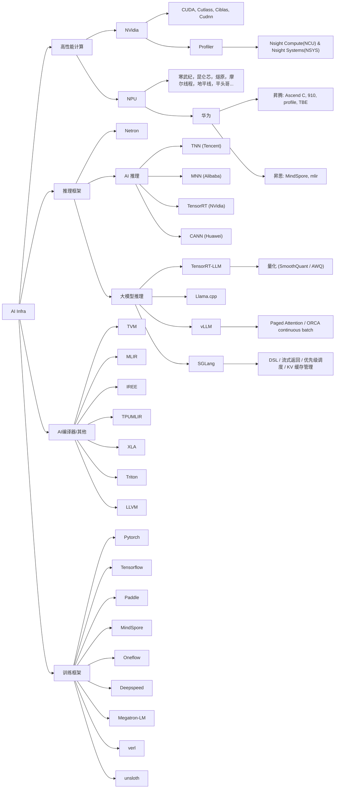
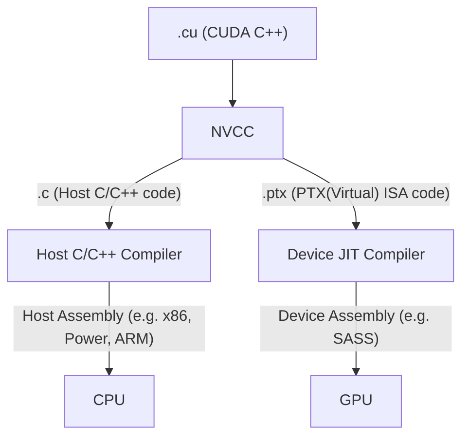

# AI 学习笔记

本仓库整理了鄙人关于生成式人工智能（Generative AI）相关算法与系统工程方向的学习笔记。

---

## HPC 高性能计算

## Training 训练

## Inference 推理

## LLM 大语言模型

## AIGC 

## RL 强化学习

---

## 学习资源

- [CS自学指南](https://csdiy.wiki/)
- [【必看】历史技术文章导航 - 猛猿的文章 - 知乎](https://zhuanlan.zhihu.com/p/654910335)
- [楚国刮大风 - B站](https://space.bilibili.com/20942052)

## 思维导图 Mind Map by Mermaid

https://mermaid.js.org/intro/syntax-reference.html

