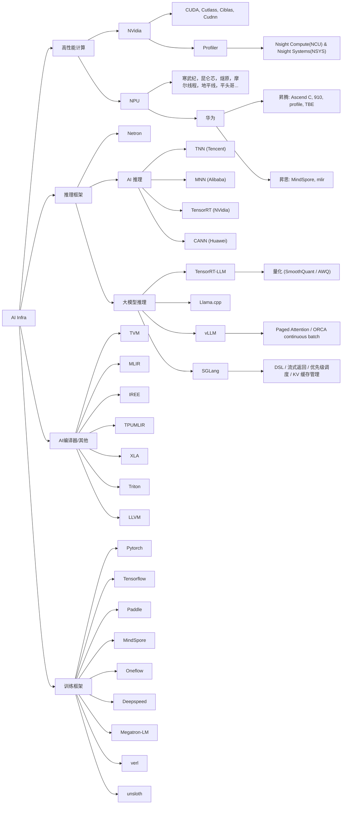
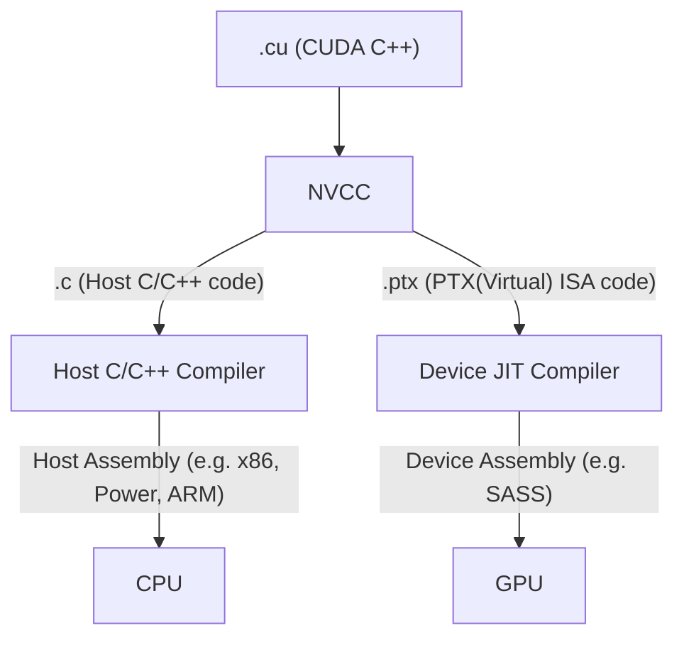

# AI 学习笔记

本仓库整理了关于生成式人工智能（Generative AI）相关算法与系统工程方向的学习笔记。

---
## 基础

### C++
运行时多态，函数与类模板，函数重载
内存泄露的场景，内存的栈/堆/静态存储区
inline函数与宏，常见关键字（static/const/explicit），智能指针，Lambda表达式
STL相关（vector/map）
常见模式设计（模板模式，单例模式）

### 数据结构
[代码随想录](https://programmercarl.com/)
[灵茶山艾府](https://space.bilibili.com/206214)
[分享｜如何科学刷题？](https://leetcode.cn/circle/discuss/RvFUtj/)
常见排序算法
栈，队列，二叉树，链表（环形，反转，合并，相交），图论，哈希

### 操作系统
[小林coding](https://xiaolincoding.com/)
线程与进程相关（线程安全，线程共享，锁，信号量，条件变量，OpenMP使用），内存的页管理，调度算法，流水线原理，Cache机制，中断等。
## HPC 高性能计算

### CUDA
shared memory的优化原理，与使用场景。
线程洗牌（shuffle）的使用场景。
thread/block/grid的关系。
几个内存关系：global/constant/texture memory。
同步，流，以及事件的使用。
bank冲突，以及如何优化。
Cutlass，Cute，Triton

注意区分
OpenAI Triton 来自 OpenAI，是一种写 GPU kernel 的 DSL，类似 CUDA C++ 的替代 用于写自定义高性能算子（FlashAttention、LayerNorm、Softmax…）。 PyTorch 2.x 的 TorchInductor 依赖它生成 fused kernels
NVIDIA Triton Inference Server 来自 NVIDIA 是一个推理部署服务器（Serving framework） 用来托管模型、调度请求、动态 batching、HTTP/gRPC 服务 Backend 支持 TensorRT / ONNX / PyTorch 等 完全不涉及写 kernel，也不使用 Triton DSL 

## Data 数据

## Algorithm 算法

mha/mqa/gqa/mla的区别。
deepseek：flashmla的实现，deepep的实现，MTP。
qwen：linear attention的基本流程，自己如何优化，gated attention的作用。
了解模型主要参数：比如多少layer，多少路由专家，head num，head dim等。
另外一些经典模型：llama，mixtral-8x7B，mistral，gemma，phi等。

flash attention的实现原理，三个版本之间的区别。
ffn模块的主要流程，比如silu激活函数，为什么ffn中要升维再降维等。
moe模块的主要流程，比如，router模块，以token为单位选择路由专家。
rope的计算逻辑，以及各类长文本扩展方案，比如sliding window，Yarn，Scale，DynamicNTK等。
Sample的主要算法：topK，topP，beam search，argmax，温度的作用。

## Training 训练

常见通信原语：all2all，allreduce，allgather等。
allreduce优化：ring allreduce，tree allreduce，reduce scatter等。
ep并行中的通信：dispatch/combine。
通信库的使用：MPI，NCCL，NIXL，还有Ray分布式框架。

## Inference 推理

模型并行：tp/ep/pp/sp并行。
attention系统级优化：ring attention，paged attention等。
kvcache优化：为什么不cache Q，kvcache大小计算，tp/pp并行下的kvcache分布等。
模型轻量化方法：awq，smoothquant，gptq，spin quant，sloth量化。
底层优化库或编程模型：flash infer，triton，tilelang。

调度优化：continous batching，chunked Prefill，radix attention，prefix cache，kvcache offload等。
系统集优化：pd分离，负载均衡，投机采样，异步调度。
框架本身一些概念：算子融合，显存复用，模型权重切分，基于pytorch的图表达等。
vllm框架与sglang框架的实现细节，比如他们的调度器如何实现，prefix cache实现上的区别等。

---

## 学习资源

- [CS自学指南](https://csdiy.wiki/)

- [科学空间 - 苏剑林](https://www.spaces.ac.cn/)
  
- [【必看】历史技术文章导航 - 猛猿的文章 - 知乎](https://zhuanlan.zhihu.com/p/654910335)
  
- [ShusenWang - B站](https://space.bilibili.com/1369507485)
  
- [楚国刮大风 - B站](https://space.bilibili.com/20942052)
  
- [ZOMI酱 - B站](https://space.bilibili.com/517221395)
- https://github.com/Infrasys-AI/AIInfra
- https://infrasys-ai.github.io/aisystem-docs/
  
- [Chayenne Zhao - 知乎](https://www.zhihu.com/people/alan-70-79-23)
- https://github.com/zhaochenyang20/Awesome-ML-SYS-Tutorial
  
- https://github.com/zjhellofss/KuiperInfer
  
- https://github.com/jinbooooom/ai-infra-hpc
  
- [进击的Bruce - 知乎](https://www.zhihu.com/people/void-73-73)
  
- [叫我Alonzo就好了 - 知乎](https://www.zhihu.com/people/liu-chang-82-34-78)

- https://se7en.mintlify.app/

### 项目

https://github.com/verl-project/verl

https://github.com/huggingface/trl
https://github.com/karpathy/nanoGPT
https://github.com/huggingface/picotron

## 思维导图 Mind Map by Mermaid

https://mermaid.js.org/intro/syntax-reference.html

