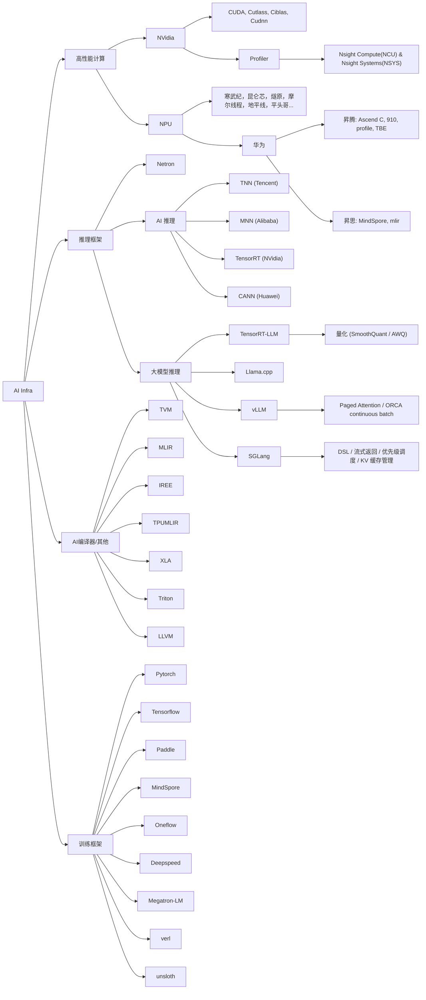

# AI 学习笔记

本仓库整理了关于生成式人工智能（Generative AI）相关算法与系统工程方向的学习笔记。

---
## HPC 高性能计算

https://leetgpu.com/challenges
https://github.com/xlite-dev/LeetCUDA

### CUDA
shared memory的优化原理，与使用场景。
线程洗牌（shuffle）的使用场景。
thread/block/grid的关系。
几个内存关系：global/constant/texture memory。
同步，流，以及事件的使用。
bank冲突，以及如何优化。

## Training 训练
- 常见通信原语：all2all，allreduce，allgather等。
- allreduce优化：ring allreduce，tree allreduce，reduce scatter等。
- ep并行中的通信：dispatch/combine。
- 通信库的使用：MPI，NCCL，NIXL，还有Ray分布式框架。

[00 Deep Learning](04%20training/00%20Deep%20Learning.md)
- [Bias 和 Variance 辨析](04%20training/00%20Deep%20Learning.md#bias-和-variance-辨析)
- [Regularization](04%20training/00%20Deep%20Learning.md#regularization)
- [Performance Metrics](04%20training/00%20Deep%20Learning.md#performance-metrics)
  - [Confusion Matrix](04%20training/00%20Deep%20Learning.md#confusion-matrix-混淆矩阵)
  - [Accuracy 准确率](04%20training/00%20Deep%20Learning.md#accuracy-准确率)
  - [Precision 精确率](04%20training/00%20Deep%20Learning.md#precision-精确率)
  - [Recall 召回率](04%20training/00%20Deep%20Learning.md#recall-召回率)
  - [F1 Score](04%20training/00%20Deep%20Learning.md#f1-score)
  - [Specificity 特异度](04%20training/00%20Deep%20Learning.md#specificity-特异度)
  - [Balanced Accuracy](04%20training/00%20Deep%20Learning.md#balanced-accuracy-平衡准确率)
- [训练流程](04%20training/00%20Deep%20Learning.md#训练流程)
  - [Forward Phase](04%20training/00%20Deep%20Learning.md#forward-phase)
  - [Backward Phase](04%20training/00%20Deep%20Learning.md#backward-phase)
  - [Gradient Descent](04%20training/00%20Deep%20Learning.md#gradient-descent)
  - [Stochastic Gradient Descent (SGD)](04%20training/00%20Deep%20Learning.md#stochastic-gradient-descent-sgd)
- [梯度检查](04%20training/00%20Deep%20Learning.md#梯度检查)
- [梯度累积](04%20training/00%20Deep%20Learning.md#梯度累积)
- [Hyperparameters](04%20training/00%20Deep%20Learning.md#hyperparameters)
  - [Network Architecture](04%20training/00%20Deep%20Learning.md#network-architecture)
  - [Activation Functions](04%20training/00%20Deep%20Learning.md#activation-functions)
  - [Weight Initializer](04%20training/00%20Deep%20Learning.md#weight-initializer)
  - [Learning Rate](04%20training/00%20Deep%20Learning.md#learning-rate)
  - [Batch Size](04%20training/00%20Deep%20Learning.md#batch-size)
  - [Momentum](04%20training/00%20Deep%20Learning.md#momentum)
  - [Optimizer](04%20training/00%20Deep%20Learning.md#optimizer)
- [Quantization 量化](04%20training/00%20Deep%20Learning.md#quantization-量化)
- [AMP 自动混合精度](04%20training/00%20Deep%20Learning.md#ampautomatic-mixed-precision自动混合精度)
  - [EMA](04%20training/00%20Deep%20Learning.md#ema)

[01 Distributed Training](04%20training/01%20Distributed%20Training.md)
- [Scaling](04%20training/01%20Distributed%20Training.md#scaling)
  - [Vertical Scaling-up 垂直扩展](04%20training/01%20Distributed%20Training.md#verbcal-scaling-up-in-a-single-node-垂直扩展--向上)
  - [Horizontal Scaling-out 水平扩展](04%20training/01%20Distributed%20Training.md#horizontal-scaling-out-across-multiple-nodes-水平扩展--向外)
  - [High Performance Networking](04%20training/01%20Distributed%20Training.md#high-performance-networking)
- [6D 并行](04%20training/01%20Distributed%20Training.md#6d-并行是什么)
- [Model Parallelism](04%20training/01%20Distributed%20Training.md#model-parallelism)
- [Pipeline Parallelism](04%20training/01%20Distributed%20Training.md#pipeline-parallelism)
  - [GPipe Pipelining](04%20training/01%20Distributed%20Training.md#gpipe-pipelining)
  - [流水线气泡 Pipeline Bubble](04%20training/01%20Distributed%20Training.md#流水线气泡-pipeline-bubble)
  - [微批次 Micro-batch](04%20training/01%20Distributed%20Training.md#微批次-micro-batch)
  - [内存问题与扩展性](04%20training/01%20Distributed%20Training.md#对内存不友好且在面对大批次时扩展性差)
  - [如何解决激活值显存占用](04%20training/01%20Distributed%20Training.md#如何解决激活值显存占用)
- [Tensor Parallelism](04%20training/01%20Distributed%20Training.md#tensor-parallelism)
- [Data Parallelism](04%20training/01%20Distributed%20Training.md#data-parallelism)
  - [Optimizer State Sharding 优化器状态分片](04%20training/01%20Distributed%20Training.md#optimizer-state-sharding-优化器状态分片)
- [Parameter Server 参数服务器同步](04%20training/01%20Distributed%20Training.md#parameter-server-ps-based-synchronization-参数服务器同步)
  - [Straggler Problem 木桶效应](04%20training/01%20Distributed%20Training.md#straggler-problem--木桶效应)
  - [Synchronous SGD Variants](04%20training/01%20Distributed%20Training.md#synchronous-sgd-variants)
  - [Asynchronous SGD](04%20training/01%20Distributed%20Training.md#asynchronous-sgd)
- [Ring All-Reduce](04%20training/01%20Distributed%20Training.md#ring-all-reduce)
  - [Scatter-Reduce](04%20training/01%20Distributed%20Training.md#scatter-reduce)
  - [All-Gather](04%20training/01%20Distributed%20Training.md#all-gather)
- [Distributed Training Frameworks](04%20training/01%20Distributed%20Training.md#distributed-training-frameworks)
- [DeepSpeed](04%20training/01%20Distributed%20Training.md#deepspeed)
  - [APIs](04%20training/01%20Distributed%20Training.md#apis)
  - [Runtime](04%20training/01%20Distributed%20Training.md#runtime)
  - [Ops](04%20training/01%20Distributed%20Training.md#ops)
  - [显存占用分析](04%20training/01%20Distributed%20Training.md#显存占用分析)
  - [ZeRO](04%20training/01%20Distributed%20Training.md#zero)
- [DDP](04%20training/01%20Distributed%20Training.md#ddp)
- [FSDP](04%20training/01%20Distributed%20Training.md#fsdp)

## Fundamentals 基础

### C++
运行时多态，函数与类模板，函数重载
内存泄露的场景，内存的栈/堆/静态存储区
inline函数与宏，常见关键字（static/const/explicit），智能指针，Lambda表达式
STL相关（vector/map）
常见模式设计（模板模式，单例模式）

### 数据结构
[代码随想录](https://programmercarl.com/)
[灵茶山艾府](https://space.bilibili.com/206214)
[分享｜如何科学刷题？](https://leetcode.cn/circle/discuss/RvFUtj/)
常见排序算法
栈，队列，二叉树，链表（环形，反转，合并，相交），图论，哈希

### 操作系统
[小林coding](https://xiaolincoding.com/)
线程与进程相关（线程安全，线程共享，锁，信号量，条件变量，OpenMP使用），内存的页管理，调度算法，流水线原理，Cache机制，中断等。

### 深度学习

[Goodfellow, Bengio, Courville, “Deep Learning”](https://www.deeplearningbook.org/)
ML performance concepts/techniques: overfitting, generalization, bias,
variance tradeoff, regularization
• Performance metrics: algorithmic and system Level
• DL training hyperparameters
	• batch size, learning rate, momentum, weight decay
• Single node vs distributed training
• Model and Data Parallelism
• Parameter server, all reduce
• Convergence and runtime
• Hardware Acceleration: GPUs, TPUs, NCCL

注意区分
OpenAI Triton 来自 OpenAI，是一种写 GPU kernel 的 DSL，类似 CUDA C++ 的替代 用于写自定义高性能算子（FlashAttention、LayerNorm、Softmax…）。 PyTorch 2.x 的 TorchInductor 依赖它生成 fused kernels
NVIDIA Triton Inference Server 来自 NVIDIA 是一个推理部署服务器（Serving framework） 用来托管模型、调度请求、动态 batching、HTTP/gRPC 服务 Backend 支持 TensorRT / ONNX / PyTorch 等 完全不涉及写 kernel，也不使用 Triton DSL 

## Data 数据

## Algorithm 算法

• Seq2Seq models
• Encoder and decoder
• Attention mechanism
• Transformer architecture: self-attention, multi-head attention, encoder-
decoder attention
• LLMs: BERT, OpenAI GPT, LLAMA, Gemini, Claude

mha/mqa/gqa/mla的区别。
deepseek：flashmla的实现，deepep的实现，MTP。
qwen：linear attention的基本流程，自己如何优化，gated attention的作用。
了解模型主要参数：比如多少layer，多少路由专家，head num，head dim等。
另外一些经典模型：llama，mixtral-8x7B，mistral，gemma，phi等。

flash attention的实现原理，三个版本之间的区别。
ffn模块的主要流程，比如silu激活函数，为什么ffn中要升维再降维等。
moe模块的主要流程，比如，router模块，以token为单位选择路由专家。
rope的计算逻辑，以及各类长文本扩展方案，比如sliding window，Yarn，Scale，DynamicNTK等。
Sample的主要算法：topK，topP，beam search，argmax，温度的作用。

RL，PPO， DPO，agentic RL

## Inference 推理

模型并行：tp/ep/pp/sp并行。
attention系统级优化：ring attention，paged attention等。
kvcache优化：为什么不cache Q，kvcache大小计算，tp/pp并行下的kvcache分布等。
模型轻量化方法：awq，smoothquant，gptq，spin quant，sloth量化。
底层优化库或编程模型：flash infer，triton，tilelang。

调度优化：continous batching，chunked Prefill，radix attention，prefix cache，kvcache offload等。
系统集优化：pd分离，负载均衡，投机采样，异步调度。
框架本身一些概念：算子融合，显存复用，模型权重切分，基于pytorch的图表达等。
vllm框架与sglang框架的实现细节，比如他们的调度器如何实现，prefix cache实现上的区别等。

## Applications 应用

---

## 学习资源

### Projects 项目

https://github.com/verl-project/verl
https://github.com/huggingface/trl
https://github.com/karpathy/nanoGPT
https://github.com/huggingface/picotron

### Blogs
- Google: https://ai.googleblog.com
- Meta: https://ai.meta.com/blog/
- Microsoft: https://news.microsoft.com/source/topics/ai/
- AWS Machine Learning Blog:https://aws.amazon.com/blogs/machine-learning/
- [CS自学指南](https://csdiy.wiki/)
- [科学空间 - 苏剑林](https://www.spaces.ac.cn/)
### Youtube
https://www.youtube.com/@AndrejKarpathy
https://mlsys.stanford.edu/
### Courses
https://stanford-cs336.github.io/spring2025/
### B站
- [ShusenWang - B站](https://space.bilibili.com/1369507485)
- [楚国刮大风 - B站](https://space.bilibili.com/20942052)
- [ZOMI酱 - B站](https://space.bilibili.com/517221395)
	- https://github.com/Infrasys-AI/AIInfra
	- https://infrasys-ai.github.io/aisystem-docs/
### 知乎
- [【必看】历史技术文章导航 - 猛猿的文章 - 知乎](https://zhuanlan.zhihu.com/p/654910335)
- [DefTruth - 知乎](https://www.zhihu.com/people/qyjdef)
- [Chayenne Zhao - 知乎](https://www.zhihu.com/people/alan-70-79-23)
	- https://github.com/zhaochenyang20/Awesome-ML-SYS-Tutorial
- [进击的Bruce - 知乎](https://www.zhihu.com/people/void-73-73)
- [叫我Alonzo就好了 - 知乎](https://www.zhihu.com/people/liu-chang-82-34-78)
其他
- https://se7en.mintlify.app/
- https://github.com/zjhellofss/KuiperInfer
- https://github.com/jinbooooom/ai-infra-hpc

## 思维导图 Mind Map by Mermaid

https://mermaid.js.org/intro/syntax-reference.html

```mermaid
flowchart LR

%% ======================
%% 顶层
%% ======================

AI["AI Infra"]

AI --> HPC["高性能计算"]
AI --> Training["训练框架"]
AI --> Inference["推理框架"]
AI --> Compiler["AI编译器/其他"]


%% ======================
%% Profiling
%% ======================
HPC --> NVidia
NVidia --> CUDA["CUDA, Cutlass, Ciblas, Cudnn"]
NVidia --> Profiler
Profiler --> NCU["Nsight Compute(NCU) & Nsight Systems(NSYS)"]


%% ======================
%% NPU 技术栈
%% ======================

HPC --> NPU
NPU --> Others["寒武纪，昆仑芯，燧原，摩尔线程，地平线，平头哥..."] 
NPU --> Huawei["华为"] 
Huawei --> Ascend["昇腾: Ascend C, 910, profile, TBE"] 
Huawei --> Mindspore["昇思: MindSpore, mlir"] 


%% ======================
%% 推理层
%% ======================
Inference --> Netron

Inference --> InferenceCore["AI 推理"]

InferenceCore --> TNN["TNN (Tencent)"]
InferenceCore --> MNN["MNN (Alibaba)"]
InferenceCore --> TensorRT["TensorRT (NVidia)"]
InferenceCore --> CANN["CANN (Huawei)"]


Inference --> LLMInfer["大模型推理"]
LLMInfer --> TensorRT-LLM
LLMInfer --> Llama.cpp
LLMInfer --> vLLM
LLMInfer --> SGLang


SGLang --> DSLCache["DSL / 流式返回 / 优先级调度 / KV 缓存管理"]
vLLM --> PagedAttention["Paged Attention / ORCA continuous batch"]
TensorRT-LLM --> Quant["量化 (SmoothQuant / AWQ)"]


%% ======================
%% 编译器栈
%% ======================

Compiler --> TVM
Compiler --> MLIR
Compiler --> IREE
Compiler --> TPUMLIR
Compiler --> XLA
Compiler --> Triton
Compiler --> LLVM


%% ======================
%% 训练框架
%% ======================

Training --> Pytorch
Training --> Tensorflow
Training --> Paddle
Training --> MindSpore
Training --> Oneflow
Training --> Deepspeed
Training --> Megatron-LM
Training --> verl
Training --> unsloth

```

